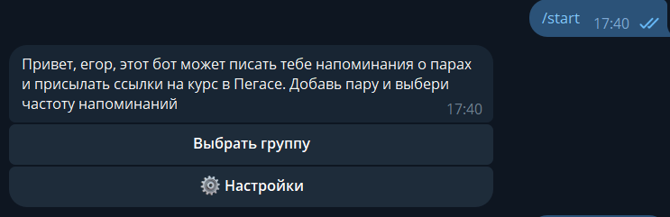
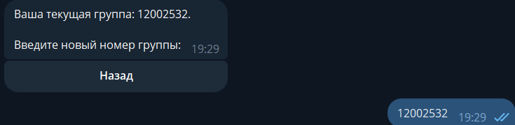
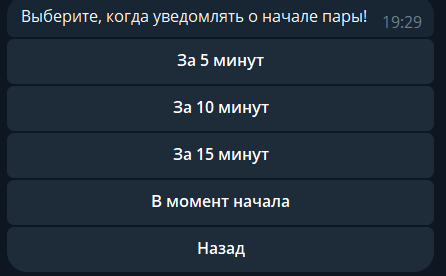

# Telegram bot for notify about lessons

@bsu_reminder_bot

## Usage

1. Enter /start in bot
   
2. Chose your group
   
3. Set notification settings
   
4. Enjoy

## Deploy

1. Clone repository

   ```
   git clone https://github.com/Sandmanager1234/bsu-reminder
   ```
2. Build project

   ```
   docker compose build
   ```
3. Create db with migrations

   ```
   docker compose run --rm bot alembic upgrade head
   ```
4. Up project

   ```
   docker compose up -d
   ```
